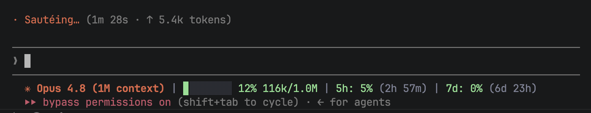

# claude-code-statusline



> [!TIP]
> **No time to read? Give this to Claude.** 👇

<table>
<tr><td>

```
Set up the Claude Code statusline from https://github.com/yatindma/claude-code-statusline.git for me.
```

</td></tr>
</table>

**Track your Claude Code 5-hour and weekly (7-day) usage limits and context window — all in
one colored status line.** No API keys, no config, no hardcoded model context sizes —
everything is read live from Claude Code / Anthropic.

[](./LICENSE)
[](./statusline-command.sh)
[](#requirements)

If this saved you from hitting your Claude Code rate limit blind, **star the repo** — it
helps other people building with [Claude Code](https://claude.com/claude-code) find it too.

A drop-in status line for [Claude Code](https://claude.com/claude-code) that shows, on one line:

- **Model** — whatever model is active (auto-detected, never hardcoded), marked with a
  Claude glyph in Claude's brand color
- **Context window usage** — `used% tokens-used/real-window-size`, with the real session
  window size read straight from what Claude Code passes on stdin (so `[1m]` / beta-expanded
  windows show correctly, and new models just work); falls back to Anthropic's API for older
  Claude Code builds
- **Claude Code 5-hour rate limit** and **weekly (7-day) rate limit** bars, color-coded, with reset countdowns

Colors follow the [Catppuccin Mocha](https://github.com/catppuccin/catppuccin) palette.
Auto-collapses to two lines if your terminal is too narrow for one.

## Why this exists

Claude Code doesn't show you how close you are to your 5-hour or weekly usage limit until
you hit it and get blocked mid-task. This status line surfaces both limits — plus context
window usage, so you know when a `/compact` is coming — right where you're already looking,
without opening a dashboard or running a separate CLI command.

### Bars change color as they fill

Both the context bar and the 5h/7d usage bars go green → yellow → peach → red live,
as usage climbs — no need to read the number to know if you're in trouble:

| Usage | Context bar | Usage limit bars |
|---|---|---|
| Low | 🟢 green (`< 50%`) | 🟢 green (`< 50%`) |
| Getting there | 🟡 yellow (`50–70%`) | 🟡 yellow (`50–75%`) |
| Careful | 🟠 peach (`70–90%`) | 🟠 peach (`75–90%`) |
| Danger | 🔴 red (`> 90%`) | 🔴 red (`> 90%`) |

## Requirements

- Claude Code with an active subscription (Pro/Max) — logged in normally, nothing extra
- [`jq`](https://jqlang.org/) — `brew install jq` (macOS) or `sudo apt install jq` (Linux)
- `curl` and `git` — already on every Mac/Linux box

No API keys to manage — the script reads the OAuth token Claude Code already stores:
- **macOS**: from Keychain, item `Claude Code-credentials`
- **Linux**: from `~/.claude/.credentials.json`

## Install

```bash
curl -o ~/.claude/statusline-command.sh \
  https://raw.githubusercontent.com/yatindma/claude-code-statusline/main/statusline-command.sh
chmod +x ~/.claude/statusline-command.sh
```

Then add this to `~/.claude/settings.json` (create the file if it doesn't exist):

```json
{
  "statusLine": {
    "type": "command",
    "command": "bash ~/.claude/statusline-command.sh"
  }
}
```

If `settings.json` already has other keys, just add the `"statusLine"` entry alongside them.

Restart Claude Code (or open a new session) — the status line appears automatically.

## Verify it works

```bash
echo '{"model":{"display_name":"Sonnet 5","id":"claude-sonnet-5"},"workspace":{"current_dir":"'"$HOME"'"},"context_window":{"used_percentage":24,"total_input_tokens":48000,"total_output_tokens":2000}}' \
  | bash ~/.claude/statusline-command.sh
```

You should see a colored line with a context bar. The usage bars appear once the usage API responds.

## How it works

| Segment | Source |
|---|---|
| Model name | Passed directly by Claude Code via stdin JSON (`model.display_name`) |
| Context bar | `context_window.used_percentage` from stdin; total window size from `context_window.context_window_size` on stdin (reflects `[1m]` / beta expansions), falling back to Anthropic's `GET /v1/models` (`max_input_tokens`, cached 6h in `/tmp`) for older Claude Code builds |
| 5h / 7-day usage | `GET https://api.anthropic.com/api/oauth/usage` (undocumented but stable endpoint Claude Code itself uses), cached 180s in `/tmp` |

Both API calls are cached to `/tmp/claude-statusline-*.json` so the status line stays fast
and doesn't spam the API on every prompt.

## Troubleshooting

| Problem | Fix |
|---|---|
| No usage bars (`5h:` / `7d:` missing) | Your OAuth token may be missing/expired. Quit Claude Code fully and reopen — it re-authenticates via browser and refreshes the Keychain/credentials file. |
| `jq: command not found` | `brew install jq` / `apt install jq` |
| Colors show as raw text like `\x1b[38;2;...` | Your terminal doesn't support truecolor, or the output isn't being interpreted — make sure nothing is piping through a tool that strips ANSI codes. |
| Status line doesn't show at all | Run the verify command above manually — if it errors, that's the exact fix needed. Confirm `"statusLine"` is valid JSON in `~/.claude/settings.json`. |
| Usage numbers look stale | `rm /tmp/claude-statusline-usage.json /tmp/claude-statusline-models.json` to force a refresh. |

## Contributing

PRs welcome — new color themes, Windows/WSL support, extra segments (cost, model
thinking-effort, whatever you find useful). Open an issue first for bigger changes.

## Support

If this is useful, **star ⭐ the repo** so more Claude Code users can find it, and share it
with anyone else running Claude Code who keeps getting surprised by their 5-hour or weekly
rate limit.

## License

MIT — do whatever you want with it.
